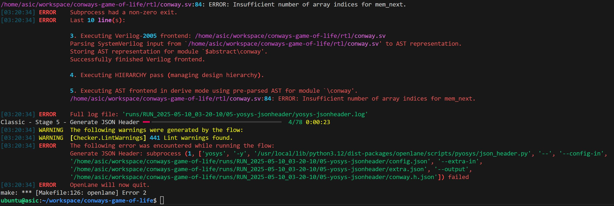

# **Conway's Game of Life**
### Robert Burns, Robert Bloomfield

For our Midterm Project we made Conway's Game of Life in hardware, using 16x parallelization. The game consists of cells on a 256x256 board, and the cells are either dead (0) or alive (1). The game is 'played' by the following rules:

1. Any live cell with fewer than two live neighbors dies, as if by underpopulation. 
2. Any live cell with two or three live neighbors lives on to the next generation. 
3. Any live cell with more than three live neighbors dies, as if by overpopulation. 
4. Any dead cell with exactly three live neighbors becomes a live cell, as if by reproduction.

The game is not actively played, but rather is observed after an inital input. The cells are initalized to all 0's, or dead cells, then the inital state of alive cells can be set in the testbench.  The one we have demo'd below with GIFs is the 'glider', which after 4 cycles will be the same pattern as it started with, but down and to the right 1 cell.

We optimized our hardware for speed by using 16 calculation units in parallel. The units each take in a different pixel in the same row and calculate its status for the next period. We made the board 256 x 256 as it is a power of 2, and evenly divisible by 16, leading to less edge cases to deal with. 

## Documented RTL code and testbench 
- our top file and submodules are shown in /rtl: ```conway.sv``` (top file with row / column control and memory writing), ```calculator.sv``` (calculations for the survival of each cell)
- our testbench is shown in /tests/conway_tb: ```conway_tb.sv```

## Simulation screenshots
### Actual Conway's Game of Life Glider


### Our Glider made in Sim


For this demonstration, we have the board be printed to a ```.txt``` file, which is then analyzed with a python file, ```conway_tests.py```, that prints back squares for dead cells and white squares for alive cells for easier visualization. For the final project, we intend to have the board be printed live to a display with a VGA driver.
We started with the inital glider state as shown in the top GIF, and after 4 cycles, it has the same shape and position as the glider in the real game. By inputting any other combination of cells, the functionality is the same as the game as found on any website such as [playgameoflife.com](https://playgameoflife.com/)

If you would like to try this yourself:
1. clone the code
2. go into the testbench and change the ```addr``` bits to indicate position. The upper 8 bits correspond to the row, with 00 being the top and ff being the bottom. The lower 8 bits correspond to the columns, with 00 the right column and ff being the left column.
3. specify the number of iterations with the counter in the for-loop.
4. in the terminal run ```make tests```
5. in the terminal run ```python3 conway_tests.py > visuals.txt``` (can use any other output file name, ```visual.txt``` was just the name we used)
6. view the output ```.txt``` file, with black squares being dead cells and white squares being alive cells

## Initial openlane timing and area results

we were able to pass ```make lint``` and ```make tests```, but we got stuck with ```make itests``` due to an error with updating our memory on line 84 ```mem <= mem_next;```. This error was also shown in our ```make openlane``` where it failed on step 4 for a similar issue, as shown in the picture below.

mainly with the line *ERROR: Insufficient number of array indices for mem_next;*, even when ```logic [255:0] mem[0:255]``` is the same size as ```logic [255:0] mem_next[0:255]```. We will be able to fix this error for the final project, and include other features.
