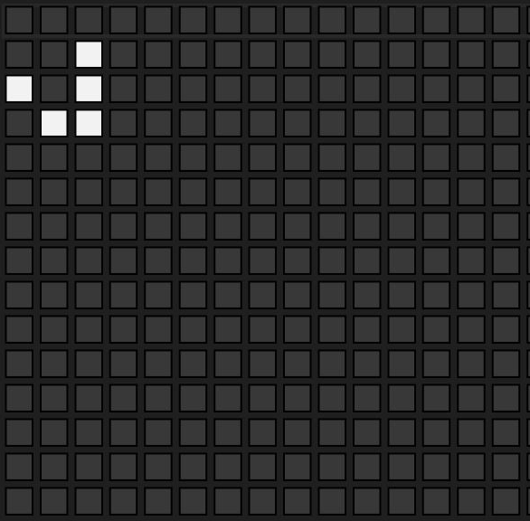

# **Conway's Game of Life**
### Robert Burns, Robert Bloomfield

For our Midterm Project we made Conway's Game of Life in hardware, using 16x parallelization. The game consists of cells on a 256x256 board, and the cells are either dead (0) or alive (1). The game is 'played' by the following rules:

1. Any live cell with fewer than two live neighbors dies, as if by underpopulation. 
2. Any live cell with two or three live neighbors lives on to the next generation. 
3. Any live cell with more than three live neighbors dies, as if by overpopulation. 
4. Any dead cell with exactly three live neighbors becomes a live cell, as if by reproduction.

The cells are initalized to all 0's, or dead cells, then the inital state of alive cells can be set in the testbench. If cells are placed in certain patterns, they have set outcomes. The one we have demo'd below with GIFs is the 'glider', which after 4 cycles will be the same pattern as it started with, but down and to the right 1 cell.

## Actual Conway's Game of Life Glider

## Our Glider made in Sim

For this demonstration, we have the board be printed to a .txt file, which is then analyzed with a python file, that prints back squares for dead cells and white squares for alive cells. For the final project, we intend to have the board be printed live to a display with a VGA driver.
